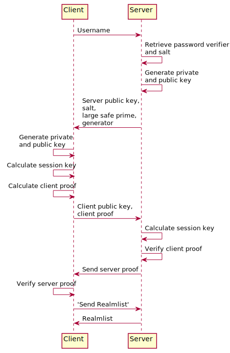

# WoW SRP6 minimal

## Reference

Implementation Guide for the World of Warcraft flavor of SRP6.

* https://gtker.com/implementation-guide-for-the-world-of-warcraft-flavor-of-srp6

* 

## Definition
```
    A	Client public key
    a	Client private key
    B	Server public key
    b	Server private key
    N	Large safe prime
    g	Generator
    k	K value
    s	Salt
    U	Username
    p	Password
    v	Password verifier
    M1	Client proof (proof first sent by client, calculated by both)
    M2	Server proof (proof first sent by server, calculated by both)
    M	(Client or server) proof
    S	S key
    K	Session key

    LS  Login Server
    WS  World Server
```

### Constant
```python
    g = 7
    N = 0x894B645E89E1535BBDAD5B8B290650530801B18EBFBF5E8FAB3C82872A3E9BB7
    k = 3
    xorNg = bytes([
        221, 123, 176, 58, 56, 172, 115, 17, 3, 152, 124,
        90, 80, 111, 202, 150, 108, 123, 194, 167,
    ])
    zero = bytes([0, 0, 0, 0])
    SHA1 = hashlib.sha1
```

### Implementation

```python
    def calculate_x(U:str, p:str, s:bytes) -> bytes:
        '''
        x = SHA1( s | SHA1( U | : | p ))
        '''
        interim = SHA1((U.upper() + ':' + p.upper()).encode()).digest()
        x = SHA1(s + interim).digest()
        return x


    def calculate_password_verifier(U:str, p:str, s:bytes) -> bytes:
        '''
        v = g^x % N
        '''
        x = int.from_bytes(calculate_x(U, p, s), byteorder='little')
        v = pow(g, x, N)
        return int.to_bytes(v, 32, 'little')


    def calculate_server_public_key(v:bytes, b:bytes) -> bytes:
        '''
        B = (k * v + (g^b % N)) % N
        '''
        v = int.from_bytes(v, byteorder='little')
        b = int.from_bytes(b, byteorder='little')
        B = (k * v + pow(g, b, N)) % N
        assert B % N != 0
        return int.to_bytes(B, 32, 'little')

    ...
```

### Test

```python
    # test1
    h1 = SHA1('test'.encode()).hexdigest()
    assert h1 == 'a94a8fe5ccb19ba61c4c0873d391e987982fbbd3'
    h2 = SHA1(b'\x53\x51').hexdigest()
    assert h2 == '0c3d7a19ac7c627290bf031ec3df76277b0f7f75'

    ...

    # test5
    password_verifier = bytes.fromhex('870A98A3DA8CCAFE6B2F4B0C43A022A0C6CEF4374BA4A50CEBF3FACA60237DC4')[::-1]
    server_private_key = bytes.fromhex('ACDCB7CB1DE67DB1D5E0A37DAE80068BCCE062AE0EDA0CBEADF560BCDAE6D6B9')[::-1]
    expected = bytes.fromhex('85A204C987B68764FA69C523E32B940D1E1822B9E0F134FDC5086B1408A2BB43')[::-1]
    #-------------------------
    v = password_verifier
    b = server_private_key
    B = calculate_server_public_key(v, b)
    assert expected == B

    ...

    # test12
    username = '7WG6SHZL33JMGPO4'
    session_key = bytes.fromhex('77a4d39cf9c0bf373ef870bd2941c339c575fdd1cbaa31c919ea7bd5023267d303e20fec9a9c402f')
    client_public_key = bytes.fromhex('0095FE039AFE5E1BADE9AC0CAEC3CB73D2D08BBF4CA8ADDBCDF0CE709ED5103F')[::-1]
    server_public_key = bytes.fromhex('00B0C41F58CCE894CFB816FA72CA344C9FE2ED7CE799452ADBA7ABDCD26EAE75')[::-1]
    salt = bytes.fromhex('00a4a09e0b5aca438b8cd837d0816ca26043dbd1eaef138eef72dcf3f696d03d')[::-1]
    expected = bytes.fromhex('7D07022B4064CCE633D679F61C6B212B6F8BC5C3')[::-1]
    #-------------------------
    U = username
    K = session_key
    A = client_public_key
    B = server_public_key
    s = salt
    M1 = calculate_client_proof(xorNg, U, K, A, B, s)
    assert expected == M1

    ...
```

### Simulation

```python
    username = 'Mario'
    password = '5#BB-:*!skTu'

    # 1. create account, save s and v to database
    # salt
    s = os.urandom(32)
    # password verified
    v = calculate_password_verifier(username, password, s)

    # 2. [LogonChallenge] client -> LS: username

    # 3. [LogonChallenge] LS -> client: B, s, N, g
    # read s and v from database by username
    # server private key
    b = os.urandom(32)
    # server public key
    B = calculate_server_public_key(v, b)

    # 4. [LogonProof] client -> LS: A, M1
    # client private key
    a = os.urandom(32)
    # client public key
    A = calculate_client_public_key(a)
    # client S key
    x = calculate_x(username, password, s)
    u = calculate_u(A, B)
    c_S = calculate_client_S_key(a, B, x, u)
    # client session key
    c_K = calculate_interleaved(c_S)
    # client proof
    c_M1 = calculate_client_proof(xorNg, username, c_K, A, B, s)

    # 5. [LogonProof] LS -> client: M2
    # server S key
    u = calculate_u(A, B)
    s_S = calculate_server_S_key(A, v, u, b)
    # server session key
    s_K = calculate_interleaved(s_S)
    # check M
    s_M1 = calculate_client_proof(xorNg, username, s_K, A, B, s)
    # authenticated
    assert c_M1 == s_M1
    # server proof
    s_M2 = calculate_server_proof(A, s_M1, s_K)

    ...
```

### Optimization
```python
def encrypt(data:bytes, session_key:bytes) -> bytes:
    '''
    E = (x ^ S) + L
    '''
    index = 0
    last_value = 0
    size = len(data)
    result = (c_ubyte * size)()
    session_key_length = len(session_key)
    for n in range(size):
        unencrypted = data[n]
        encrypted = (unencrypted ^ session_key[index]) + last_value
        index = (index + 1) % session_key_length
        last_value = encrypted
        result[n] = encrypted
    return bytes(result)


def decrypt(data:bytes, session_key:bytes) -> bytes:
    '''
    x = (E - L) ^ S
    '''
    index = 0
    last_value = 0
    size = len(data)
    result = (c_ubyte * size)()
    session_key_length = len(session_key)
    for n in range(size):
        encrypted = data[n]
        unencrypted = (encrypted - last_value) ^ session_key[index]
        index = (index + 1) % session_key_length
        last_value = encrypted
        result[n] = unencrypted
    return bytes(result)
```
```
    8K, 100 times, seconds.
    py     : 1.4836305      1.00x
    py[x]  : 0.3124920      4.74x
    pyx    : 0.0106925    138.75x
    cpp    : 0.0470868     31.50x
    c+pyapi: 0.0081375    182.31x
```


## External Resources

* RFC 2945 - The SRP Authentication and Key Exchange System

    https://tools.ietf.org/html/rfc2945


* RFC 5054 - Using the Secure Remote Password (SRP) Protocol for TLS Authentication

    https://tools.ietf.org/html/rfc5054

